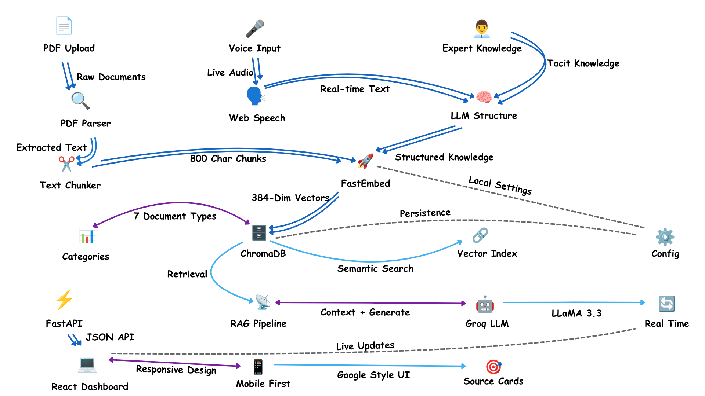

<div align="center">

# Industrial Knowledge Intelligence

### The Unified Operations Brain for Petroleum Refineries & Petrochemical Plants

[](https://python.org)
[](https://fastapi.tiangolo.com)
[](https://react.dev)
[](https://langchain.com)
[](https://trychroma.com)
[](https://groq.com)
[](https://neo4j.com)

---


</div>

---

## The Problem This Solves

Two crises are colliding in the industrial sector right now.

**Crisis 1 — The Retirement Wave.** 25% of experienced process engineers will retire this decade. When they go, 80% of critical operational knowledge — equipment quirks, safety workarounds, troubleshooting instincts built over 30 years — walks out the door with them. No SOP captures "you can hear a bearing starting to fail before any sensor trips." No manual documents "this vendor always ships the wrong gasket, order from the other one." That knowledge is irreplaceable. Unless it's captured first.

**Crisis 2 — The Documentation Overload.** The average refinery runs 7–12 disconnected document systems. Engineers spend 35% of their working hours just *searching* for information — hunting through OISD standards, CSB reports, OEM manuals, and maintenance logs that exist in silos, speak different languages, and are impossible to cross-reference under pressure.


**Industrial Knowledge Intelligence** is the answer to both.

It is an AI-powered, seven-screen operations platform that simultaneously **preserves expert knowledge** through live speech capture and **accelerates knowledge access** through intelligent RAG-powered retrieval across a 102-document corpus of regulatory standards, incident reports, OEM manuals, and maintenance records.

One pipeline. Two directions. A plant that learns and never forgets.

---

## Demo Video

<div align="center">

https://github.com/user-attachments/assets/0de9af3b-83a1-4df1-af0f-ec57b151975c

</div>

---

## The Numbers

| Problem | Scale | Source |
|---|---|---|
| Hours/week engineers spend searching for information | 35% of working time | McKinsey Global Survey 2024 |
| Disconnected document systems per large plant | 7–12 systems | NASSCOM-EY Study |
| Unplanned downtime linked to knowledge fragmentation | 18–22% of incidents | BIS Research |
| Experienced engineers retiring this decade | 25% of the workforce | Industry estimate |
| Expert knowledge that exists **only in people's heads** | **80%** | MIT Research |
| Cost of knowledge loss per critical expert departure | $2M–$5M | Industry estimate |

---

## Architecture

<div align="center">
  
  <br/>
  <em>Complete system architecture</em>
</div>

---

## The Seven Screens

Every screen is a distinct operational capability, powered by the same unified RAG pipeline with a mode-specific system prompt. One backend, seven specialized intelligences.

### Screen 1 — Document Upload
> `POST /upload`

Drag a PDF in. That's it. The system stores it, then runs the full ingestion pipeline asynchronously — parse, chunk, embed, index. The upload screen shows live progress through each pipeline stage and flips the document to "indexed" when complete. Non-blocking; the API returns immediately.

Supports PDFs up to 50 MB. Ingested documents land in the `uploaded` category and become immediately searchable across all seven screens.

---

### Screen 2 — AI Copilot
> `POST /query`

The core RAG engine. Ask any question in natural language. The copilot retrieves the top-k most relevant chunks from the vector index, passes them with the question to LLaMA 3.3 70B, and returns a structured answer with inline citations `[1]`, `[2]`, and a confidence score (HIGH / MEDIUM / LOW).

The sample questions on the home screen are dynamically generated based on which document categories are currently indexed — so they always reflect the actual corpus, not hardcoded strings.

Supports optional category filtering (restrict search to incident reports, regulatory standards, OEM manuals, etc.) and configurable `top_k` (1–20 chunks).

---

### Screen 3 — Asset Explorer
> `GET /asset/{tag}`

Click any equipment tag from a P&ID — `P-101A`, `E-203`, `PSV-301`, `TK-001` — and pull everything the knowledge base knows about that asset: OEM specifications, work order history, inspection findings, operating procedures, and related incident reports. All in one place.

The query is enriched by the Neo4j equipment graph. If `P-101A` is connected to `E-101` and `FIC-101`, the system automatically includes context about those connected assets in the answer — because equipment failures don't respect isolation boundaries.

Neo4j is optional. If it's not running, the system falls back to pure vector search silently.

---

### Screen 4 — Maintenance Intelligence
> `POST /maintenance/rca`

Provide an equipment tag and a failure symptom. The maintenance agent joins structured work order records with unstructured inspection notes, OEM failure mode data, and historical incident reports to produce a full Root Cause Analysis report:

- **Failure Summary** — what failed, observed symptoms
- **Probable Root Causes** — ranked by evidence strength, with citations
- **Contributing Factors** — process conditions, maintenance gaps, human factors
- **Recommended Actions** — immediate / short-term PM / long-term engineering fix
- **Similar Historical Incidents** — matching patterns from the corpus

This is the same data engineers dig through for days during outage investigations, surfaced in seconds.

---

### Screen 5 — Compliance Intelligence
> `POST /compliance`

Provide a compliance topic and optional equipment or area. The compliance agent maps live plant state against the full stack of applicable Indian regulations — OISD, PESO, Factories Act 1948, EPA 1986, and DGMS circulars — then surfaces:

- **Applicable Regulations** — specific clauses and sections
- **Current State Assessment** — what the documents show
- **Compliance Gaps** — delta between requirement and current state
- **Evidence Pack** — documents from the corpus that serve as audit evidence
- **Corrective Actions** — prioritised by risk (CRITICAL / HIGH / MEDIUM / LOW)

Audit preparation that used to take weeks, done in under a minute.

---

### Screen 6 — Notifications
> `GET /notifications`

Proactive, not reactive. A background job calls this endpoint on a schedule. It scans the entire knowledge base for active risk patterns, compliance flags approaching deadlines, and lessons from historical incidents relevant to current plant conditions — then pushes a digest to the alert feed.

This is the lessons-learned engine working in the background, surfacing warnings before similar conditions lead to the same incidents the corpus documents.

---

### Screen 7 — Knowledge Capture
> `POST /capture/process`

**This is the differentiator.** The Digital Apprenticeship System.

An experienced engineer sits down, selects equipment context, and clicks Record. The browser's Web Speech API captures their speech in real time — no plugins, no server round-trips, zero setup. They speak naturally: "When P-101A starts cavitating, the first thing you do is check the suction strainer. You can usually hear it as a crackling sound before any alarm trips..."

When they stop, the transcript goes to LLaMA 3.3 70B with a knowledge extraction prompt that pulls out:

- Safety-critical steps (LOTO, PPE, hazard awareness)
- Equipment-specific quirks and normal vs. abnormal indicators
- Step-by-step troubleshooting logic
- Tacit knowledge — "feel," experience-based judgments
- Regulatory compliance references

The structured output is embedded and stored in ChromaDB under the `expert_knowledge` category. From that moment, it appears in every search — the Copilot quotes it, the Asset Explorer surfaces it, the RCA engine factors it in.

Photo attachments let engineers visually document equipment states alongside their verbal explanations.

One captured session can preserve knowledge that took 30 years to accumulate.


---

## Document Corpus

102 documents assembled from authoritative public sources, covering the full operational knowledge stack of a petroleum refinery. All files are tracked via Git LFS.

| Category | Count | Key Sources |
|---|---|---|
| **P&IDs & Process Diagrams** | 19 | AIChE standards, OSHA process safety diagrams, Honeywell DCS references, 12 synthetic ISA-5.1 compliant plant P&IDs (CDU, HDS, utilities, offsites) |
| **OEM Equipment Manuals** | 14 | Emerson/Fisher control valves, Atlas Copco compressors, Alfa Laval heat exchangers, Pentair pressure relief, SKF bearing installation & service life guides, Siemens drives, 2 synthetic centrifugal pump IOMs |
| **Regulatory & Standards** | 30 | OISD-STD-117, OISD-STD-144, OISD-STD-152, PESO regulations, DGMS circulars, Factories Act 1948, Environment Protection Act 1986, OSHA PSM Guidelines (29 CFR 1910.119) |
| **Incident & Safety Reports** | 21 | CSB: BP Texas City, Chevron Richmond, ExxonMobil, Macondo/Deepwater Horizon, Imperial Sugar, Motiva, PES, Tosco Avon; ILO Major Hazard Control; DGMS Safety Alert 2025; CSB FY2025 Annual Report |
| **Maintenance & Inspection Data** | 18 | SKF bearing guides, NASA CMAPSS turbofan dataset, GE Predictive Maintenance WP, AI4I 2020 dataset, 4 synthetic inspection checklists (pump, heat exchanger, relief valve, instrument calibration), 2160-row sensor CSV, OSHA Maintenance Inspection Guide |

Full provenance — source URL, document type, description — tracked in [`corpus_manifest.csv`](./corpus_manifest.csv).

---

## Technology Stack

| Layer | Technology | Notes |
|---|---|---|
| **Document Parsing** | PyMuPDF 1.28 | Fast ONNX-based extraction; scanned PDF detection (< 20 chars/page) |
| **Text Chunking** | LangChain `RecursiveCharacterTextSplitter` | 800-char chunks, 150-char overlap; industrial-aware separators |
| **Embeddings** | FastEmbed `BAAI/bge-small-en-v1.5` | 384-dim ONNX, runs fully local, ~130 MB one-time download, no API key |
| **Embedding (alt)** | Gemini `gemini-embedding-001` | Optional; higher quality, requires `GOOGLE_API_KEY` |
| **Vector Database** | ChromaDB 1.3.5 | Local persistence, incremental upsert, idempotent re-indexing |
| **LLM** | Groq `llama-3.3-70b-versatile` | Free tier; 7 specialized system prompts via `langchain-groq` |
| **Equipment Graph** | Neo4j 5.12 | Optional; Docker Compose; 15 equipment nodes, CONNECTED_TO edges |
| **Backend API** | FastAPI 0.111 + Uvicorn | Async background tasks for document ingestion |
| **Frontend** | React 18 + Vite 5 + TailwindCSS 3 | 7-screen SPA; responsive; no React Router |
| **HTTP Client** | Axios 1.7 | 120s timeout; Vite dev proxy eliminates CORS in dev |
| **Speech Recognition** | Web Speech API | Browser-native; zero server cost; real-time interim results |
| **Markdown Rendering** | react-markdown 9 | For LLM answer display in the Copilot |
| **File Upload UI** | react-dropzone 14 | Drag & drop with per-file progress |
| **Icons** | lucide-react 0.427 | Consistent iconography across all screens |
| **Synthetic Corpus** | ReportLab 5 | Generates ISA-5.1 P&IDs, pump IOMs, inspection records |

**Zero cloud dependency for core operation.** FastEmbed runs locally. ChromaDB persists locally. The only external calls are to Groq's free LLM API for answer generation.


---

## Repository Structure

```
industrial-knowledge-copilot/
│
├── api/
│   ├── __init__.py
│   └── main.py                    # FastAPI app — all 9 endpoints, CORS, static file mounts
│
├── ingestion/
│   ├── pdf_parser.py              # PyMuPDF text extraction + corpus_manifest.csv integration
│   ├── chunker.py                 # Industrial-aware text splitter (800/150), DocumentChunk dataclass
│   ├── embedder.py                # FastEmbed/Gemini → ChromaDB upsert, idempotency, rate-limit retry
│   ├── run_ingestion.py           # CLI entry: parse → subset selection → chunk → embed
│   └── seed_graph.py              # Seeds Neo4j with 15 equipment nodes + CONNECTED_TO edges
│
├── rag_engine/
│   ├── copilot.py                 # 4 prompt modes: ask / rca / compliance / notify + LLM runner
│   ├── retriever.py               # Semantic search with category filter + fallback logic
│   └── graph.py                   # Neo4j neighbor traversal for equipment context enrichment
│
├── frontend/
│   ├── src/
│   │   ├── App.jsx                # Root: state-driven screen routing + layout shell
│   │   ├── api.js                 # Axios client wrapping all 9 API endpoints
│   │   ├── components/
│   │   │   ├── Sidebar.jsx        # Collapsible left nav with notification badge
│   │   │   ├── Header.jsx         # Top bar with live KPI strip (chunks / docs / categories)
│   │   │   ├── AnswerPanel.jsx    # Markdown answer + collapsible source list
│   │   │   ├── ConfidenceBadge.jsx# HIGH / MEDIUM / LOW colored indicator
│   │   │   ├── SourceCard.jsx     # Per-source card with category color + external URL
│   │   │   ├── Spinner.jsx        # Animated loading indicator
│   │   │   └── ErrorBanner.jsx    # Dismissible error display
│   │   └── screens/
│   │       ├── UploadScreen.jsx         # Drag-drop, per-file progress, pipeline step display
│   │       ├── CopilotScreen.jsx        # Chat UI, dynamic sample questions, category filter
│   │       ├── AssetScreen.jsx          # Equipment tag search, quick-select chips
│   │       ├── MaintenanceScreen.jsx    # RCA form + structured section renderer
│   │       ├── ComplianceScreen.jsx     # Gap check + evidence pack renderer
│   │       ├── NotifyScreen.jsx         # Auto-loading alert digest, severity badges
│   │       └── KnowledgeCaptureScreen.jsx # Speech recording, photo attach, LLM processing
│   ├── vite.config.js             # Dev proxy: /api/* → http://localhost:8000
│   ├── tailwind.config.js
│   └── package.json
│
├── corpus/                        # 102-document corpus (Git LFS — run `git lfs pull`)
│   ├── pids/                      # 19 P&IDs and process diagrams
│   ├── oem_manuals/               # 14 OEM equipment manuals
│   ├── regulatory/                # 30 regulatory and standards documents
│   ├── incident_reports/          # 21 incident investigation reports
│   └── maintenance_data/          # 18 maintenance, inspection, and sensor files
│
├── chroma_db/                     # Persisted vector index (created on first ingestion)
├── uploads/                       # User-uploaded PDFs (created at runtime)
│
├── generate_pids.py               # Synthetic ISA-5.1 P&ID PDF generator
├── generate_pump_manuals.py       # Synthetic pump IOM PDF generator
├── generate_inspection_docs.py    # Synthetic inspection records + 2160-row sensor CSV
│
├── corpus_manifest.csv            # Provenance: source URL, category, document type, description
├── docker-compose.yml             # Neo4j 5.12 service (optional, for graph traversal)
├── requirements.txt               # Pinned Python dependencies
├── .env.example                   # Environment variable template
└── KNOWLEDGE_CAPTURE_MODULE.md    # Deep-dive design doc for the Knowledge Capture module
```


---

## Getting Started

### Prerequisites

- Python 3.11+
- Node.js 18+ and npm
- Git LFS (`git lfs install`)
- A free Groq API key from [console.groq.com](https://console.groq.com)
- Docker (optional — only needed for Neo4j graph traversal)

---

### Step 1 — Clone and Pull the Corpus

```bash
git clone https://github.com/your-org/industrial-knowledge-copilot.git
cd industrial-knowledge-copilot

# Pull the corpus PDFs stored in Git LFS (~155 MB)
git lfs pull
```

---

### Step 2 — Set Up Python Environment

```bash
python -m venv venv
source venv/bin/activate        # Windows: venv\Scripts\activate
pip install -r requirements.txt
```

---

### Step 3 — Configure Environment Variables

```bash
cp .env.example .env
```

Open `.env` and set your Groq API key. Everything else works with the defaults:

```env
# Required — get a free key at https://console.groq.com
GROQ_API_KEY=gsk_...

# Embedding backend — 'fastembed' runs fully local (recommended)
EMBEDDING_BACKEND=fastembed
FASTEMBED_MODEL=BAAI/bge-small-en-v1.5

# Optional — only needed if switching to Gemini embeddings
GOOGLE_API_KEY=AIza...

# Storage paths (defaults work as-is)
CHROMA_PERSIST_DIR=./chroma_db
CORPUS_DIR=./corpus

# RAG tuning
LLM_MODEL=llama-3.3-70b-versatile
TOP_K_RETRIEVAL=8
CHUNK_SIZE=800
CHUNK_OVERLAP=150
```

---

### Step 4 — Run the Ingestion Pipeline

The ingestion pipeline parses PDFs, chunks them into 800-character overlapping segments, generates embeddings using FastEmbed (ONNX, runs locally), and persists everything to ChromaDB.

```bash
# Fast mode — indexes the 2 richest documents (~30 seconds, good for first test)
python -m ingestion.run_ingestion

# Demo mode — indexes 16 documents across all categories (~3 minutes)
python -m ingestion.run_ingestion --max-total 16

# Full corpus — all 102 documents (~30 minutes, ~13,779 chunks)
python -m ingestion.run_ingestion --full

# Check what's indexed
python -m ingestion.run_ingestion --stats-only
```

Ingestion is **idempotent** — re-running it skips already-indexed chunks and only processes new documents.

---

### Step 5 — Start the Backend API

```bash
python -m api.main
```

- API root: `http://localhost:8000`
- Interactive Swagger docs: `http://localhost:8000/docs`
- ReDoc: `http://localhost:8000/redoc`

---

### Step 6 — Start the Frontend

```bash
cd frontend
npm install
npm run dev
```

- Dashboard: `http://localhost:3000`

The Vite dev server proxies all `/api/*` requests to `http://localhost:8000` automatically. No CORS configuration needed.

---

### Step 7 (Optional) — Start the Equipment Knowledge Graph

The Neo4j graph enriches Asset Explorer queries with connected equipment context. If it's not running, the system falls back to pure vector search silently — so this step is truly optional.

```bash
# Start Neo4j
docker-compose up -d

# Seed the equipment graph (15 nodes, CONNECTED_TO edges)
python ingestion/seed_graph.py
```

Neo4j browser UI: `http://localhost:7474` (credentials: `neo4j` / `password`)


---

## API Reference

All seven dashboard screens map directly to dedicated API endpoints. One backend pipeline, seven specialized modes.

| Screen | Method | Endpoint | Auth Required |
|---|---|---|---|
| Document Upload | `POST` | `/upload` | No (embedding only) |
| AI Copilot | `POST` | `/query` | `GROQ_API_KEY` |
| Asset Explorer | `GET` | `/asset/{tag}` | `GROQ_API_KEY` |
| Maintenance Intel | `POST` | `/maintenance/rca` | `GROQ_API_KEY` |
| Compliance Intel | `POST` | `/compliance` | `GROQ_API_KEY` |
| Notifications | `GET` | `/notifications` | `GROQ_API_KEY` |
| Knowledge Capture | `POST` | `/capture/process` | `GROQ_API_KEY` |
| — | `GET` | `/health` | None |
| — | `GET` | `/corpus/stats` | None |
| — | `GET` | `/corpus/categories` | None |
| — | `GET` | `/documents` | None |

---

### AI Copilot

```json
POST /query
{
  "question": "What caused the BP Texas City refinery explosion?",
  "category": "incident_reports",
  "top_k": 8
}
```

```json
{
  "answer": "The BP Texas City explosion was caused by... [1][2]",
  "confidence": "HIGH",
  "sources": [
    {
      "index": 1,
      "filename": "CSB_BP_Texas_City_Investigation_Digest.pdf",
      "category": "incident_reports",
      "relevance_score": 0.9231,
      "excerpt": "The blowdown drum and stack..."
    }
  ],
  "chunks_retrieved": 8
}
```

`category` is optional. Valid values: `pids`, `oem_manuals`, `regulatory`, `incident_reports`, `maintenance_data`, `uploaded`, `expert_knowledge`.

---

### Maintenance RCA

```json
POST /maintenance/rca
{
  "equipment_tag": "P-101A",
  "symptom": "High bearing temperature alarm at 88°C, vibration trending upward over 3 weeks",
  "top_k": 10
}
```

Returns a structured RCA report with failure summary, ranked root causes with evidence citations, contributing factors, recommended actions, and similar historical incidents.

---

### Compliance Intelligence

```json
POST /compliance
{
  "topic": "pressure relief valve testing and certification",
  "equipment_or_area": "CDU overhead system",
  "top_k": 10
}
```

Returns applicable OISD/PESO clauses, current state assessment, compliance gaps with risk priority, evidence pack for auditors, and corrective action recommendations.

---

### Asset Explorer

```bash
GET /asset/P-101A?top_k=12
```

Returns everything the knowledge base knows about equipment tag `P-101A`, enriched with context from connected equipment (E-101, FIC-101, TK-001) via the Neo4j graph.

---

### Knowledge Capture

```json
POST /capture/process
{
  "transcript": "To check P-101A bearing health, first isolate with LOTO procedure MW-47. Remove coupling guard. Listen for crackling — that means the cage is starting to fail, well before any temperature alarm trips. Feel the bearing housing: warm is normal, hot means call maintenance immediately. Vibration above 7mm/s RMS on the DE is the threshold from SKF.",
  "equipment_context": "P-101A",
  "session_type": "maintenance_procedure"
}
```

```json
{
  "status": "success",
  "structured_knowledge": "## Equipment: P-101A\n## Procedure: Bearing Health Check...",
  "message": "Expert knowledge captured and indexed successfully",
  "equipment_context": "P-101A"
}
```

The structured output is immediately embedded and searchable across all screens.


---

## How the Ingestion Pipeline Works

Understanding the pipeline helps when troubleshooting or extending the system.

### 1. Parse (`ingestion/pdf_parser.py`)

PyMuPDF opens each PDF and extracts text page by page. The parser:
- Loads `corpus_manifest.csv` to enrich each document with `source_url`, `description`, `document_type`, and `category`
- Falls back to folder name for category if the manifest is missing or has no matching entry
- Flags scanned/image-only PDFs (< 20 average characters per page) and skips them during chunking

### 2. Chunk (`ingestion/chunker.py`)

LangChain's `RecursiveCharacterTextSplitter` splits extracted text with industrial-domain-aware separators:

```
\n\n\n  →  \n\n  →  \nSection  →  \nCHAPTER  →  numbered clauses  →  \nTable  →  bullets  →  sentences  →  words
```

Each chunk is assigned a stable ID: `{filename}::chunk_{n:04d}`. Chunks shorter than 100 characters are discarded.

### 3. Embed (`ingestion/embedder.py`)

FastEmbed generates 384-dimensional embeddings using the `BAAI/bge-small-en-v1.5` ONNX model — entirely local, no API calls. Chunks are batch-upserted into ChromaDB. The embedder checks existing IDs before upserting, making every run idempotent. Gemini embeddings are available as an alternative via `EMBEDDING_BACKEND=gemini`.

### 4. Index (ChromaDB)

Embeddings and full metadata (filename, category, source_url, document_type, description, chunk_index, page_count) are stored in the local ChromaDB collection. The collection persists to `./chroma_db/`.

### Retrieval

`rag_engine/retriever.py` uses the same embedding model to embed the query (with `task_type="query"` for FastEmbed's asymmetric retrieval), runs cosine similarity search, and returns `RetrievedChunk` objects with relevance scores. Category filtering is supported via ChromaDB metadata filters.

### Generation

`rag_engine/copilot.py` selects one of four system prompts based on the calling endpoint, formats the retrieved chunks as numbered context blocks, and invokes Groq's LLaMA 3.3 70B. Every response is parsed for `Confidence: HIGH/MEDIUM/LOW` and surfaced to the frontend.

---

## Equipment Knowledge Graph

The Neo4j graph models physical plant topology. Equipment nodes are connected by `CONNECTED_TO` edges representing actual process flow or instrument loops.

**Seeded equipment (15 nodes):**

```
TK-001  ←→  P-101A  ←→  E-101  ←→  F-101  ←→  V-101
                ↕                       ↕          ↕
             FIC-101               TIC-205      PSV-101
                                                   |
                                    E-201  ←→  V-601  ←→  P-201A
                                      ↕
                                   CT-401  ←→  B-101
                                              R-601  ←→  K-601
```

When the Asset Explorer queries `P-101A`, it automatically also queries for `TK-001`, `E-101`, and `FIC-101` — giving a complete picture of the asset's operating context rather than just the isolated equipment record.

To add more equipment to the graph, edit `ingestion/seed_graph.py` and re-run it. To visualize the full graph: open the Neo4j browser at `http://localhost:7474` and run `MATCH (n)-[r]->(m) RETURN n,r,m`.


---

## Knowledge Capture — The Digital Apprenticeship System

The Knowledge Capture module deserves its own section because it's architecturally distinct from pure RAG — it's a live knowledge *creation* pipeline, not just retrieval.

### The Core Insight

Every organization has two types of knowledge:
- **Explicit knowledge** — documented in manuals, SOPs, standards. This is what RAG retrieves.
- **Tacit knowledge** — lived experience, intuition, pattern recognition. This is what retires.

Tacit knowledge is the kind that says "that bearing sound means you have 2 weeks before failure" or "that vendor always delivers the wrong coupling, order part number X not Y." No document captures it. Until now.

### How It Works

```
Expert selects equipment context (e.g. "P-101A")
            ↓
Clicks "Start Recording"
            ↓
Web Speech API streams audio → real-time transcript appears on screen
            ↓
Expert stops recording
            ↓
POST /capture/process → Groq LLaMA 3.3 70B
            ↓
LLM extracts: safety steps · procedure steps · expert tips · regulatory refs
            ↓
Structured output embedded via FastEmbed → ChromaDB (category: expert_knowledge)
            ↓
Immediately searchable across all 7 screens
```

### What Gets Extracted

The LLM processes the transcript with a specialized industrial knowledge extraction prompt that identifies and structures:

| Extracted Field | Example |
|---|---|
| Safety Requirements | LOTO procedure MW-47, confined space permit, H2S monitor required |
| Step-by-step Instructions | Numbered procedure derived from informal walkthrough |
| Equipment-specific Quirks | "This pump always has air in the suction line after a turnaround" |
| Diagnostic Indicators | Sounds, temperatures, pressures that indicate specific conditions |
| Expert Tips | Experience-based judgment that no manual documents |
| Regulatory References | OISD, OSHA, API standards relevant to the procedure |

### Browser Compatibility

The Knowledge Capture screen uses the Web Speech API — a browser-native feature with zero installation:

| Browser | Support |
|---|---|
| Chrome 25+ | Excellent |
| Edge 79+ | Excellent |
| Safari 14.1+ | Good |
| Firefox 100+ | Basic |

### Photo Documentation

Engineers can attach photos alongside their verbal explanations — equipment nameplates, valve positions, gauge readings, wear patterns. Photos are base64-encoded and sent with the transcript to the backend for comprehensive knowledge capture.

### Full Design Specification

See [`KNOWLEDGE_CAPTURE_MODULE.md`](./KNOWLEDGE_CAPTURE_MODULE.md) for the complete design document, including:
- Detailed implementation architecture
- Web Speech API vs. local Whisper comparison
- Knowledge extraction prompt template
- Use cases: equipment walkthroughs, troubleshooting sessions, vendor knowledge, post-incident debriefs
- Three-phase deployment roadmap (MVP → Enhanced → Advanced)
- ROI analysis

---

## Generating Synthetic Corpus Documents

The repository includes three generators that create realistic industrial PDFs when real documents aren't available or aren't shareable:

```bash
# Generate ISA-5.1 compliant P&ID PDFs (process flow diagrams with equipment symbols)
python generate_pids.py

# Generate centrifugal pump Installation, Operation, and Maintenance manuals
python generate_pump_manuals.py

# Generate inspection checklists, work orders, and a 2160-row sensor time-series CSV
python generate_inspection_docs.py
```

All generated documents follow realistic industrial formats and include authentic equipment tags, operating parameters, and maintenance language. They are indistinguishable in structure from real plant documents and index well into the RAG pipeline.


---

## Configuration Reference

All configuration lives in `.env`. Copy `.env.example` as the starting point.

| Variable | Default | Description |
|---|---|---|
| `GROQ_API_KEY` | *(required)* | LLM inference. Free tier at [console.groq.com](https://console.groq.com) |
| `EMBEDDING_BACKEND` | `fastembed` | `fastembed` (local, no key) or `gemini` (requires `GOOGLE_API_KEY`) |
| `FASTEMBED_MODEL` | `BAAI/bge-small-en-v1.5` | 384-dim ONNX model. Downloads ~130 MB once on first run |
| `GOOGLE_API_KEY` | *(optional)* | Only required when `EMBEDDING_BACKEND=gemini` |
| `EMBEDDING_MODEL` | `gemini-embedding-001` | Gemini embedding model name |
| `LLM_MODEL` | `llama-3.3-70b-versatile` | Groq model name |
| `TOP_K_RETRIEVAL` | `8` | Number of chunks retrieved per query (1–20) |
| `CHUNK_SIZE` | `800` | Characters per chunk |
| `CHUNK_OVERLAP` | `150` | Overlap between adjacent chunks |
| `CHROMA_PERSIST_DIR` | `./chroma_db` | ChromaDB persistence directory |
| `CORPUS_DIR` | `./corpus` | Root directory of the document corpus |

**Neo4j** (only needed for graph traversal — set in `rag_engine/graph.py` or as env vars):

| Variable | Default | Description |
|---|---|---|
| `NEO4J_URI` | `bolt://localhost:7687` | Neo4j Bolt connection URI |
| `NEO4J_USER` | `neo4j` | Neo4j username |
| `NEO4J_PASSWORD` | `password` | Neo4j password |

---

## Troubleshooting

**Empty search results after ingestion**

The embedder writes to the `"industrial_knowledge"` ChromaDB collection. The retriever connects to `"industrial_knowledge_repaired"`. If you're starting from a clean database, run the ingestion pipeline once and the collection the retriever expects should be populated from your prior run. If not, check that `CHROMA_PERSIST_DIR` points to the same directory in both `.env` and any scripts you run directly.

**`GROQ_API_KEY not configured` error**

The API returns HTTP 503 if `GROQ_API_KEY` is missing. Make sure `.env` is in the project root and the key starts with `gsk_`. Upload (`POST /upload`) works without a Groq key — it only uses the embedding pipeline.

**Scanned PDFs skipped during ingestion**

PDFs with fewer than 20 average characters per page are flagged as image-only and skipped. If a legitimate PDF is being skipped, lower the detection threshold in `pdf_parser.py` line `is_scanned = avg_chars < 20`.

**Speech recognition not working**

Knowledge Capture requires a browser that supports the Web Speech API (Chrome, Edge, Safari). Firefox has limited support. The screen shows a clear error if the API isn't available.

**Neo4j connection refused**

Asset Explorer queries fall back to pure vector search silently if Neo4j is not running. This is expected and intentional. Start Neo4j only if you want graph-enriched asset context.

**Frontend showing `Failed to get response`**

Check that the backend is running at `http://localhost:8000` and that the Vite dev server's proxy is active (it's configured in `frontend/vite.config.js`). Restart both the backend and frontend if the proxy connection was lost.


---

## Design Decisions

A few architectural choices worth explaining:

**Why Groq + LLaMA instead of OpenAI?**
Groq's free tier provides fast inference on LLaMA 3.3 70B with no cost for prototyping. The system is LangChain-based and swapping to any other provider is a one-line change. The goal was zero required spend for anyone evaluating this project.

**Why FastEmbed instead of OpenAI Embeddings?**
FastEmbed runs entirely locally using ONNX Runtime. No API key, no rate limits, no embedding costs, works offline. The `BAAI/bge-small-en-v1.5` model produces 384-dimensional embeddings that are highly competitive with larger commercial models on retrieval benchmarks. Gemini embeddings are offered as an alternative for teams that want higher-dimensional representations.

**Why ChromaDB instead of Pinecone or Weaviate?**
Local persistence, zero infrastructure, no account required. For a plant that needs an air-gapped deployment, this matters. ChromaDB supports the same semantic search capabilities as cloud alternatives for corpus sizes up to tens of millions of vectors.

**Why Web Speech API instead of Whisper for Knowledge Capture?**
Web Speech API works in the browser with zero setup and no server-side audio processing. For a hackathon demonstration that needs to run anywhere instantly, it's the right default. Local Whisper is documented in `KNOWLEDGE_CAPTURE_MODULE.md` as the production path for higher accuracy and full offline operation.

**Why state-driven routing instead of React Router?**
The dashboard is a single-page application with a fixed set of screens. State-driven routing (`useState` in `App.jsx`) is simpler, has no URL-based navigation requirements, and eliminates the need for `BrowserRouter` configuration. For a seven-screen tool, it's the pragmatic choice.

---

## What's Next

The current system is fully functional and production-ready for its scope. Natural extensions include:

- **Local Whisper integration** — replace Web Speech API with offline transcription for higher accuracy on technical vocabulary
- **Video recording** — capture equipment walkthroughs with synchronized audio/visual (planned in Phase 2 of `KNOWLEDGE_CAPTURE_MODULE.md`)
- **Expanded equipment graph** — connect all corpus documents to their equipment tags via Neo4j relationships for true graph-RAG queries
- **Scheduled notifications** — move the `/notifications` endpoint to a cron job that pushes alerts to a notification channel
- **Multi-plant support** — ChromaDB collection namespacing to serve multiple plant sites from one deployment
- **OCR pipeline** — add Tesseract or AWS Textract support for scanned PDFs (currently flagged and skipped)
- **Real-time sensor integration** — connect live SCADA/DCS data feeds to the notification engine for predictive alerts

---

## Team

| Name | GitHub Profile |
|---|---|
| **Anuj A** | [a-anuj](https://github.com/a-anuj) |
| **Harish J** | [harish1604](https://github.com/harish1604) |
| **Hari Prasath K** | [hariPrasathK-Dev](https://github.com/hariPrasathK-Dev) |

---

<div align="center">

**Built for the Economic Times Hackathon 2026**

*Theme: AI for Industrial Knowledge Intelligence: Unified Asset & Operations Brain*

---

*Preserving the knowledge that keeps plants running safely.*
*Accelerating the decisions that keep engineers a step ahead.*

</div>
